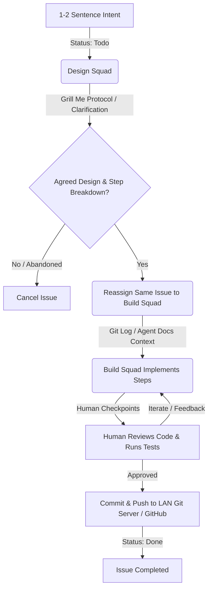

# Orchestrating Game Development with Global Squads

Reducing friction and minimizing cognitive overhead is a common goal in software development. When I first adopted Multica for my game development projects—such as building an [Asteroids clone](https://asteroids.jeffluntgames.com/) from scratch, I faced a question: how can I use Multica's squads to be general purpose software development squads that I could use across projects and tech stacks?

Managing thirty different agent configs and background processes for thirty different repositories is a recipe for configuration fatigue and context rot. Instead, I settled on a simpler approach: utilizing [five global, role-based squads](https://github.com/jefflunt/build-multica) across all of my codebases.

This article describes four key aspects of this workflow, illustrating how it can help build a flexible, tech-stack-agnostic development pipeline that relies on local-first setup, clear human-in-the-loop checkpoints, and robust codebase grounding.

---

## 1. Local Directory Mapping (Bypassing GitHub Overhead)

Many AI-assisted development tools require extensive cloud integration, pushing and pulling branch states through remote GitHub APIs. While remote integrations are powerful, they introduce latency, security considerations, and synchronization overhead. 

In my workflow, I bypass remote GitHub integrations entirely by leveraging local directory mapping.

### How to Attach Local Projects
In the Multica UI, you can directly bind a project to a local absolute directory on your filesystem. 
1. Create a new project in your Multica Workspace.
2. In the project settings, attach the absolute local path of your directory (e.g., `/Users/jefflunt/code/asteroids`).
3. Ensure your local Multica daemon is running. The daemon will automatically detect and bind to this local directory when executing tasks.
4. Any Issues that Multica works on for this project will now be scoped to that project's folder.

### The Power of Local-First Repositories
Because the local directory on your machine is already a git repository, you do not need an intermediary remote host to manage version control. The local daemon executes file modifications and commands directly inside your working directory. 

This model offers several major advantages:
- **Zero Remote Latency:** No waiting for webhook roundtrips or GitHub API limits.
- **Firewall & LAN Friendly:** Ideal for offline development, local-first environments, or corporate networks with strict egress rules.
- **Independent Commits:** You retain absolute control over when, how, and where changes are staged, committed, and pushed to your LAN git server or upstream remotes.

---

## 2. Global, Tech-Stack-Agnostic Squads

Instead of defining bespoke squads within each project, I utilize a central [workspace directory](https://github.com/jefflunt/build-multica) containing a single set of five global, role-based squads:
1. **Design Squad** (Initiates brainstorming and grills the user to flesh out ideas)
2. **Build Squad** (Implements features and runs tests)
3. **Doc Squad** (Drafts and updates technical documentation)
4. **Review Squad** (Writes, critiques, defends, and watches comments on PRs)
5. **Multica Squad** (Used to create and update Multica squads based on feedback)

### Decoupling Squads from Projects
By separating squads from individual repositories, it makes is easier to drop these squads into any project, rather than the squad having project-specific cruft. The same five squads seamlessly transition between a Go backend, a Next.js frontend, or a custom game engine.

### How Tech-Stack-Agnostic Agents Succeed
*How can a single, generic Build Squad build a Go server in the morning and a game engine feature in the afternoon without custom, per-language instructions?*

The secret lies in the natural capabilities of modern LLMs:
1. **Implicit Language Fluency:** Modern LLMs are inherently multi-lingual and deeply versed in software engineering standards across virtually all major languages and frameworks. They do not require hand-holding or verbose prompting just to write clean Go or TypeScript.
2. **Standardized Tooling and Discovery:** By configuring the squads with flexible, general-purpose filesystem and execution tools (such as file reads, writes, and bash execution), the agents can inspect local files (like `package.json`, `go.mod`, or `Cargo.toml`) to auto-discover dependencies, compilers, and test runners on their own.

---

## 3. Issue Lifecycle State Machine (Context-Rich Threads)

The issue lifecycle in this workflow is governed by a human-in-the-loop state machine. Rather than spawning new issues for every small handoff, we keep the **same issue open** and reassign it dynamically across different agents and squads.

### The 5-Step Lifecycle
1. **Intent:** The human starts with a brief, high-level intent (often just 1-2 sentences, such as *"Add a medium asteroid size to the game"*).
2. **Design & "Grill Me" Loop:** The issue is assigned to the `Design Squad`. The design agent initiates the [**"Grill Me" protocol**](https://github.com/mattpocock/skills/blob/main/skills/productivity/grilling/SKILL.md), asking targeted, sharp questions to flush out edge cases, structural choices, and verify requirements. Once aligned, the Design Squad produces a high-level design document and a step-by-step implementation plan.
3. **Reassignment (The Handoff):** With a solid plan approved, the human reassigns the **same issue** to the `Build Squad`.
4. **Implementation:** The build agent reads the plan from the comment history or design folder, claims the task, modifies the code, and verifies the changes.
5. **Human Validation Checkpoint:** The build agent hands the issue back to the human. The human checks out the code, runs local tests, and performs the final sign-off.

### Each Squad Has the Full Context of the Issue Thread
Keeping the same issue active across the entire lifecycle is crucial. The issue comment thread becomes the **primary reference for context**. Because all design questions, user answers, planning breakdowns, and tool outputs are recorded in a single continuous timeline, the incoming build agent has immediate access to the full conversational history. No context is lost in handoff.

---

## 4. Continuous Alignment & Grounding

A major concern with AI agents is drift—either the agent misunderstands the codebase patterns, or its context goes stale because the local repository shifted while the issue sat dormant. 

I use a technique that I call [Continuous Alignment](https://contalign.jefflunt.com/introduction/), which you can think of as you and the agent getting on the same page. This approach grounds agents using two authoritative local sources:

### 1. `agent_docs`
In each project I'm running, I maintain a lightweight `/agent_docs` directory in our repository following the [agent_docs framework](https://github.com/jefflunt/agent_docs). This acts as a progressive disclosure and alignment layer:
- `01_orientation/`: Quickly establishes high-level architecture and domain boundaries.
- `02_patterns/`: Teaches the agent local code styles, state management rules, and testing standards.
- `03_deep_dives/`: Holds detailed technical articles on complex internal subsystems.
- `04_plans/`: Keeps track of current design specifications and step-by-step task lists.

The agents read the `agent_docs/` files to understand exactly what standards they must adhere to. It's the `agent_docs/` folder that contains project-specific information, _not the squads_. This is key to how a squad can be general purpose, and yet still operate effectively on almost anything: it's the information in `agent_docs/` that bridges the project-specific gaps.

But documentation is hard to keep up-to-date, right? Well, that's why I created the [`doc-v1` squad](https://github.com/jefflunt/build-multica/tree/main/doc-v1), so that I can get quality documentation with very little manual effort.

### 2. Git History (`git log` & `git status`)
Because our local Multica projects are bound to active git repositories, incoming agents are instructed to run `git log` and `git status` during their initial orientation phase. This allows them to:
- See what files have been recently modified.
- Understand what changes have occurred in neighboring branches or `main` since the issue was created.
- Re-orient themselves to the exact current state of the local filesystem, reducing the risk that agents overwrite active local edits or work on top of stale code.

---

## Conclusion: Keeping it Simple

By combining local directory mapping, global role-based squads, reference-rich issue threads, and codebase grounding, it is possible to reduce the complexity and configuration overhead often associated with multi-agent orchestration. 

This workflow shows that complex cloud integrations or per-project agent configurations are not always necessary to build software efficiently.
